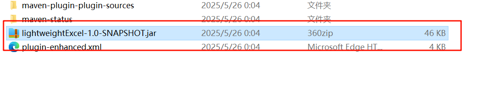
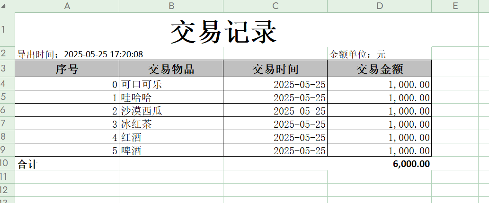

## excel工具网上很多，但是符合自己项目所需的基本没有，还是需要进行改造或者进行模板化适配，因此开发了此工具。本工具非常适合财务系统，自带金额汇总，带金额单位，导出时间等要素。

## 取名来由：因为有easy-excel,fast-excel等优秀的项目，本项目定位是少量代码，快速实现。打包后的压缩包仅46kb


# excel导入核心特性

Apache POI支持: 同时支持.xls和.xlsx格式
智能类型转换: 更好的处理POI的各种Cell类型
日期处理: 支持Excel原生日期格式和字符串日期格式
数值处理: 智能处理整数和小数的显示
公式支持: 自动计算公式单元格的值


主要优势 

格式兼容性: 支持老版本.xls和新版本.xlsx
类型处理: 更精确的Excel单元格类型识别和转换
日期支持: 原生支持Excel日期格式
稳定性: Apache POI是更成熟的Excel处理库

技术细节： 
自动格式检测: 自动识别Excel文件格式
空值处理: 更好的空行和空单元格处理
错误恢复: 单个单元格错误不影响整行数据
内存管理: 支持大文件的流式处理

这个版本在处理复杂的Excel文件时更加稳定和准确，特别是在处理不同数据类型和格式时表现更好。

- 使用
```java
  // 导入第一个Sheet
  ImportResult<UserInfo> result = PoiExcelImportUtil.importFirstSheet(fileName, UserInfo.class);

// 导入指定Sheet
ImportResult<UserInfo> result = PoiExcelImportUtil.importSheet(fileName, "员工信息", UserInfo.class);

// 导入多个Sheet
List<String> sheets = Arrays.asList("员工信息", "部门信息");
Map<String, ImportResult<UserInfo>> results = PoiExcelImportUtil.importMultiSheet(fileName, sheets, UserInfo.class);
```

# excel导出
 ## 具有以下特点：

- 支持第一行为标题
- 第二行第一列显示导出时间，最后一列显示金额单位
- 自动对数值列增加表尾合计
- 支持多sheet导出
- 使用对象属性注解定义表格标题和格式
- 超长自动换行

## 项目结构说明
这个工具包含两个主要部分：

- ExcelExportUtil.java - 核心导出工具类

包含ExcelColumn和ExcelSheet两个注解
提供单Sheet和多Sheet导出方法
实现自动格式化日期、金额等数据格式
自动汇总需要合计的列


- ExcelExportDemo.java - 使用示例

演示单Sheet导出
演示多Sheet导出
包含两个示例实体类：财务报表和薪资报表

- 性能
双sheet导出，各5w条，导出4s

 


主要功能特点
1. 注解系统

@ExcelSheet - 应用于类，定义表格信息
``` java
@ExcelSheet(name = "财务报表", moneyUnit = "元")
```
@ExcelColumn - 应用于字段，定义列信息
``` java
@ExcelColumn(title = "收入", order = 3, numberFormat = "#,##0.00", needSum = true)
```


2. 格式处理

支持自定义日期格式：dateFormat = "yyyy-MM-dd"
支持自定义数值格式：numberFormat = "#,##0.00"
自动处理不同类型：支持Date、LocalDate、LocalDateTime、各种数值类型

3. 汇总功能

使用needSum = true标记需要汇总的列
自动计算合计并添加底部汇总行

## 使用示例

1、定义实体类
``` java
@Data
@ExcelSheet(name = "交易记录", moneyUnit = "元")
public   class TransactionEntity {
    @ExcelField(title = "序号")
    private Integer index;
    @ExcelField(title = "交易物品")
    private String name;
    @ExcelField(title = "交易时间")
    private Date date;
    @ExcelField(title = "交易金额", sum = true)
    private BigDecimal money;

}
```

2、导出数据
``` java
// 准备数据
List<FinancialReport> reportList = new ArrayList<>();
// 填充数据...

// 导出Excel
try (OutputStream os = new FileOutputStream("financial_report.xlsx")) {
    FastExcelExportUtil.exportSingleSheet(os, reportList);
}
```

3、多Sheet导出

``` java
            // 导出到文件
            try (FileOutputStream fos = new FileOutputStream("export_data.xlsx")) {

               //多sheet导出 准备多个Sheet的数据
                List<ExcelExportUtil.SheetData<T>> exportDataList = new ArrayList<>();
                exportDataList.add(createSalesSheetData());
                exportDataList.add(createUerInfoSheetData());
                ExcelExportUtil.exportMultiSheet(fos, exportDataList);

                //单sheet导出
               ExcelExportUtil.export(fos, buildUserInfoData(), UserInfoEntity.class);

                System.out.println("Excel导出成功：export_data.xlsx");
            } catch (Exception e) {
                throw new RuntimeException(e);
            }
```

()

# future
- 增加金额单位的参数，而不是注解，满足不同场景下导出不同单位的金额数据
- 导入跳过表尾合计
- 其他更好的内容

# 觉得本项目帮助到了你，就请start,fork一下

# 如果有好的想法，欢迎贡献


## 技术交流


### 关注后回复：“excel交流”，拉你进群
